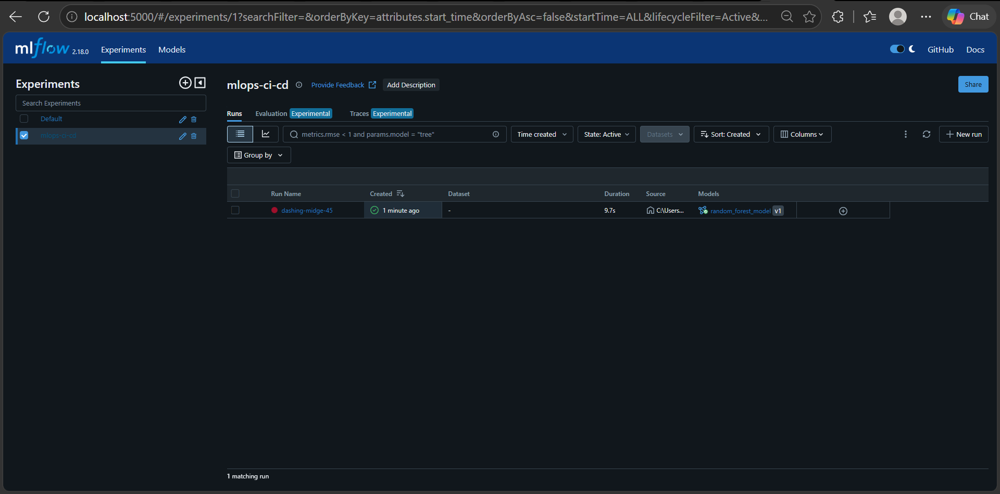
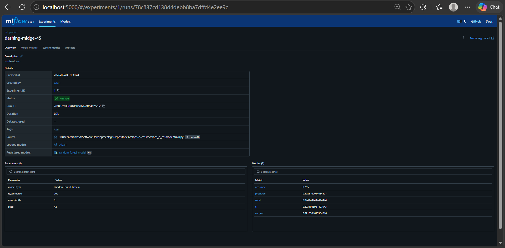
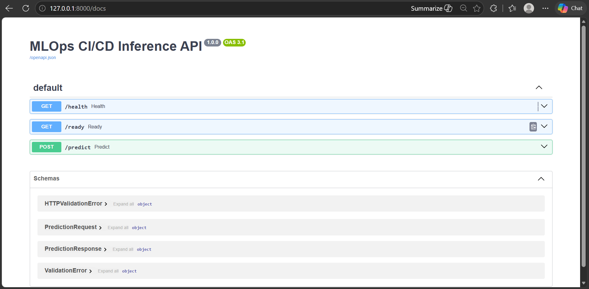
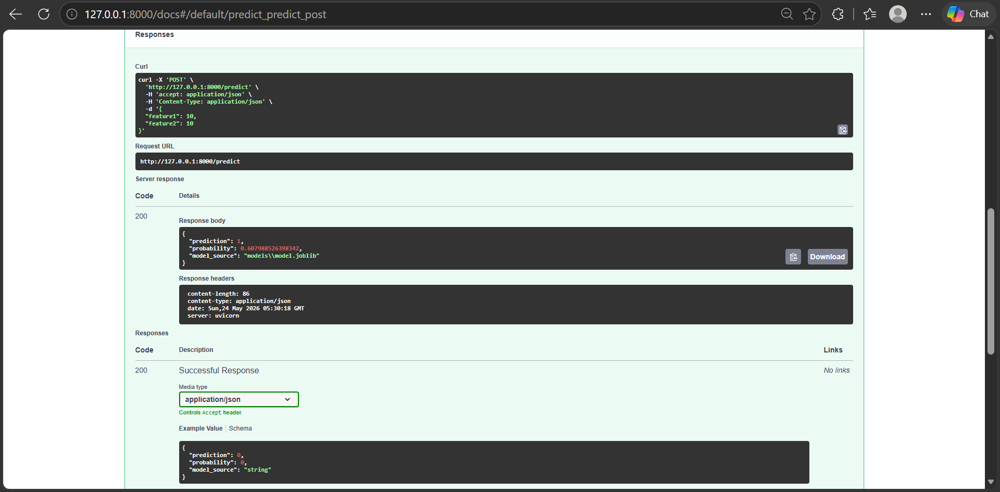
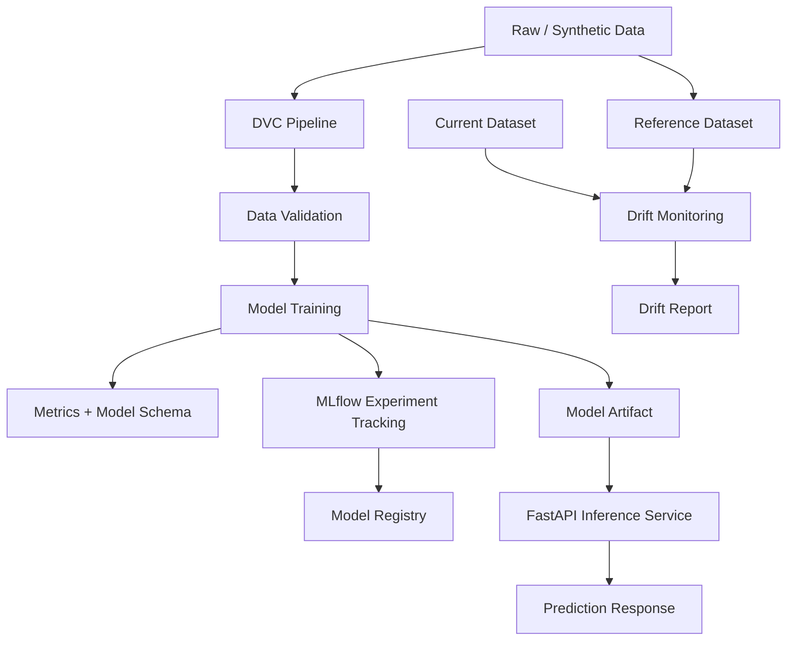

<div align="center">

# 🚀 MLOps CI/CD Pipeline

### Production-ready Machine Learning Operations platform for reproducible training, validation, experiment tracking, drift monitoring, and FastAPI inference.

<p>
  
  
  
</p>

<p>
  
  
  
</p>

<p>
  
  
  
</p>

<p>
  <a href="#-overview">Overview</a> •
  <a href="#-features">Features</a> •
  <a href="#-screenshots">Screenshots</a> •
  <a href="#-architecture">Architecture</a> •
  <a href="#-quick-start">Quick Start</a> •
  <a href="#-mlflow-workflow">MLflow</a> •
  <a href="#-troubleshooting">Troubleshooting</a>
</p>

</div>

---

## 📌 Overview

**MLOps CI/CD Pipeline** is a production-style machine learning operations project that demonstrates how an ML model moves from data validation to reproducible training, experiment tracking, model packaging, drift monitoring, containerized deployment, and online inference.

It is designed as a **portfolio-grade AI/ML engineering project**: lightweight enough to run locally, but structured around the same patterns used in real ML platforms — reproducible pipelines, model governance, automated CI/CD checks, API serving, and post-training monitoring.

---

## ✨ Features

<table>
<tr>
<td width="33%" valign="top">

### 🧠 ML Lifecycle

- Data generation pipeline
- Data quality validation
- Scikit-learn model training
- Metrics and schema artifacts
- MLflow experiment tracking
- Model registry integration

</td>
<td width="33%" valign="top">

### ⚙️ MLOps Platform

- DVC pipeline orchestration
- Reproducible `dvc repro` workflow
- Drift monitoring reports
- Environment-based config
- Dockerized inference service
- CI/CD pipeline automation

</td>
<td width="33%" valign="top">

### 🚀 Engineering

- FastAPI inference API
- Typed Pydantic contracts
- Health and readiness routes
- Unit and smoke tests
- Ruff linting and Bandit scans
- Production-oriented README/docs

</td>
</tr>
</table>

---

## 🧱 Tech Stack

<div align="center">

<table>
<tr>
<td align="center" width="25%">
<br/>
<b>Python</b><br/>
Core Language
</td>

<td align="center" width="25%">
<br/>
<b>FastAPI</b><br/>
Inference API
</td>

<td align="center" width="25%">
<br/>
<b>DVC</b><br/>
ML Pipelines
</td>

<td align="center" width="25%">
<br/>
<b>MLflow</b><br/>
Experiments
</td>
</tr>

<tr>
<td align="center">
<br/>
<b>Scikit-learn</b><br/>
Modeling
</td>

<td align="center">
<br/>
<b>Great Expectations</b><br/>
Validation
</td>

<td align="center">
<br/>
<b>GitHub Actions</b><br/>
CI/CD
</td>

<td align="center">
<br/>
<b>Docker</b><br/>
Containerization
</td>
</tr>

<tr>
<td align="center">
<br/>
<b>Pytest</b><br/>
Testing
</td>

<td align="center">
<br/>
<b>Ruff</b><br/>
Linting
</td>

<td align="center">
<br/>
<b>Bandit</b><br/>
Security
</td>

<td align="center">
<br/>
<b>Pydantic</b><br/>
Validation
</td>
</tr>

</table>

</div>

---

## 📸 Screenshots

#### 📊 MLflow Experiment Tracking

<p align="center">
  
  
</p>

#### 🚀 FastAPI Inference API

<p align="center">
  
  
</p>

---

## 🏗️ Architecture

<div align="center">



</div>

### 🔄 End-to-End Workflow

```text
Data Generation
      ↓
Data Validation
      ↓
DVC Pipeline Execution
      ↓
Model Training
      ↓
MLflow Experiment Logging
      ↓
Model Registry
      ↓
FastAPI Inference Serving
      ↓
Drift Monitoring
      ↓
CI/CD Validation
```

### System Flow

| Step |                            What Happens                            |
|------|--------------------------------------------------------------------|
|  1   | Data is generated or loaded into the raw data layer                |
|  2   | DVC orchestrates validation, training, and registry stages         |
|  3   | Validation checks ensure training data is usable before modeling   |
|  4   | Model training produces metrics, schema, and serialized artifacts  |
|  5   | MLflow logs experiments, signatures, input examples, and artifacts |
|  6   | FastAPI loads the trained model and serves typed predictions       |
|  7   | Drift monitoring compares reference data against current data      |

---

<details>
<summary><strong>📁 Folder Structure</strong></summary>

```text
mlops-ci-cd/
├── .github/
│   └── workflows/                 # CI/CD and Docker build workflows
├── data/
│   └── raw/                       # Training data generated or tracked by DVC
├── docs/
│   └── screenshots/               # README screenshots and portfolio visuals
├── models/                        # Trained model artifacts
├── notebooks/                     # Optional exploration notebooks
├── reports/                       # Validation, metrics, schema, and drift reports
├── scripts/                       # Utility scripts
├── src/
│   ├── mlops_ci_cd/
│   │   ├── api/                   # FastAPI inference service
│   │   ├── config/                # Runtime settings and environment config
│   │   ├── data/                  # Data generation and validation
│   │   ├── model/                 # Training and MLflow registry logic
│   │   ├── monitoring/            # Drift monitoring utilities
│   │   └── schemas/               # Pydantic request/response contracts
│   └── tests/                     # Unit and smoke tests
├── Dockerfile
├── dvc.yaml
├── pyproject.toml
├── requirements.txt
└── README.md
```

</details>

---

## ⚡ Quick Start

### Prerequisites

| Requirement |             Version               |
|-------------|-----------------------------------|
|    Python   | 3.10–3.12                         |
|    Git      | Any recent version                |
|    Docker   | Optional                          |
|    DVC      | Installed from `requirements.txt` |
|    MLflow   | Installed from `requirements.txt` |

### Run Locally

```bash
python -m venv .venv
source .venv/bin/activate
pip install -r requirements.txt
pip install -e .
dvc repro
uvicorn mlops_ci_cd.api.main:app --reload
```

Open:

```text
http://127.0.0.1:8000/docs
```

### Windows PowerShell Activation

```powershell
python -m venv .venv
.venv\Scripts\Activate.ps1
pip install -r requirements.txt
pip install -e .
```

### Run Tests

```bash
pytest
```

### Run Quality Checks

```bash
ruff check .
bandit -r src
```

---

## 📊 MLflow Workflow

### Start Tracking Server

```bash
mlflow server \
  --backend-store-uri sqlite:///mlflow.db \
  --default-artifact-root ./mlruns \
  --host 0.0.0.0 \
  --port 5000
```

Open:

```text
http://localhost:5000
```

### Configure Environment

```bash
export MLFLOW_TRACKING_URI=http://localhost:5000
export MLFLOW_EXPERIMENT=mlops-ci-cd
```

### Reproduce Pipeline

```bash
dvc repro
```

### Register Model

```bash
python -m mlops_ci_cd.model.registry --name random_forest_model
```

The training workflow logs:

|     Artifact    |                 Purpose                  |
|-----------------|------------------------------------------|
| Metrics         | Accuracy, precision, recall, F1, ROC-AUC |
| Model artifact  | Serialized trained model                 |
| Model schema    | Input feature contract                   |
| Input example   | Example payload for MLflow model serving |
| Model signature | Inference input/output validation        |
| Parameters      | Training and experiment configuration    |

---

## 📈 Drift Monitoring

```bash
python -m mlops_ci_cd.monitoring.drift \
  --reference data/raw/train.csv \
  --current data/raw/train.csv \
  --report reports/drift_report.json
```

### Drift Report Summary

|       Output      |                    Description                  |
|-------------------|-------------------------------------------------|
| Reference profile | Baseline training distribution                  |
| Current profile   | New production or batch scoring distribution    |
| Mean shift        | Feature-level distribution movement             |
| Drift flag        | Indicates when threshold is exceeded            |
| JSON report       | Machine-readable report for CI/CD or dashboards |

---

## 🔌 API Reference

### Health Check

```bash
curl http://127.0.0.1:8000/health
```

### Readiness Check

```bash
curl http://127.0.0.1:8000/ready
```

### Prediction

```bash
curl -X POST http://127.0.0.1:8000/predict \
  -H "Content-Type: application/json" \
  -d '{"features":[5.1,3.5,1.4,0.2]}'
```

### Swagger UI

```text
http://127.0.0.1:8000/docs
```

---

## 🐳 Docker

### Build

```bash
docker build -t mlops-ci-cd:latest .
```

### Run

```bash
docker run -p 8000:8000 mlops-ci-cd:latest
```

Open:

```text
http://localhost:8000/docs
```

---

## 🔄 CI/CD Pipeline

<table>
<tr>
<td width="20%" align="center">

### 🧹 Lint

Ruff validates code style and catches common Python issues.

</td>
<td width="20%" align="center">

### 🧪 Test

Pytest runs unit and smoke tests for training, validation, drift, and API behavior.

</td>
<td width="20%" align="center">

### 🔁 Repro

DVC checks that the ML pipeline can be reproduced in CI.

</td>
<td width="20%" align="center">

### 🛡️ Security

Bandit scans Python source files for common security issues.

</td>
<td width="20%" align="center">

### 🐳 Docker

GitHub Actions validates that the container image builds successfully.

</td>
</tr>
</table>

---

## 🧪 What This Project Demonstrates

|      Skill Area     |                     Demonstrated Through                       |
|---------------------|----------------------------------------------------------------|
| ML Engineering      | Model training, metrics, schema artifacts, experiment tracking |
| MLOps               | DVC pipelines, MLflow tracking, registry flow, reproducibility |
| Backend Engineering | FastAPI inference, typed schemas, health/readiness routes      |
| Data Quality        | Validation checks before training and report generation        |
| Monitoring          | Drift reports for reference vs current datasets                |
| DevOps              | Docker, GitHub Actions, environment-based configuration        |
| Testing             | Pytest coverage for pipeline, API, validation, and drift logic |
| Production Thinking | CI gates, model signatures, Docker health checks, clean docs   |

---

## 🧰 Troubleshooting

<details>
<summary><strong>DVC says an output is already specified in another stage</strong></summary>

DVC does not allow the same file to be listed as an output in multiple places.

If `reports/metrics.json` appears under both `outs` and `metrics`, keep it only under `metrics`:

```yaml
metrics:
  - reports/metrics.json:
      cache: false
```

Then run:

```bash
rm -f dvc.lock
dvc repro
```

</details>

<details>
<summary><strong>MLFLOW_TRACKING_URI not set; skipping registry step</strong></summary>

This is expected when running without an MLflow tracking server.

Start MLflow:

```bash
mlflow server \
  --backend-store-uri sqlite:///mlflow.db \
  --default-artifact-root ./mlruns \
  --host 0.0.0.0 \
  --port 5000
```

Then set:

```bash
export MLFLOW_TRACKING_URI=http://localhost:5000
```

Run:

```bash
dvc repro
```

</details>

<details>
<summary><strong>Pydantic warns about protected namespace model_</strong></summary>

If your settings use fields like `model_path` or `model_uri`, configure protected namespaces:

```python
from pydantic_settings import BaseSettings, SettingsConfigDict

class Settings(BaseSettings):
    model_config = SettingsConfigDict(
        protected_namespaces=("settings_",)
    )
```

</details>

<details>
<summary><strong>Drift command says --current is required</strong></summary>

The drift module expects both reference and current datasets:

```bash
python -m mlops_ci_cd.monitoring.drift \
  --reference data/raw/train.csv \
  --current data/raw/train.csv \
  --report reports/drift_report.json
```

</details>

<details>
<summary><strong>Ruff BLE001: Do not catch blind exception</strong></summary>

Avoid broad exception handling:

```python
except Exception:
    mlflow = None
```

Use a specific import error:

```python
except ImportError:
    mlflow = None
```

</details>

<details>
<summary><strong>DVC cannot import DIR_MARK from pathspec</strong></summary>

Pin compatible dependency versions:

```txt
dvc==3.59.2
pathspec==0.12.1
```

Then reinstall:

```bash
pip install -r requirements.txt
```

</details>

<details>
<summary><strong>FastAPI returns 404 for /favicon.ico</strong></summary>

This is harmless. Browsers automatically request a favicon. The API is working if these routes return successful responses:

```text
/docs
/health
/ready
```

</details>

---

## 🔄 Recommended Clean Rebuild

```bash
python -m venv .venv
source .venv/bin/activate
pip install --upgrade pip
pip install -r requirements.txt
pip install -e .
ruff check .
pytest
dvc repro
uvicorn mlops_ci_cd.api.main:app --reload
```

For Windows PowerShell:

```powershell
python -m venv .venv
.venv\Scripts\Activate.ps1
pip install --upgrade pip
pip install -r requirements.txt
pip install -e .
ruff check .
pytest
dvc repro
uvicorn mlops_ci_cd.api.main:app --reload
```

---

## 🗺️ Roadmap

| Priority |                Improvement               |
|----------|------------------------------------------|
|   High   | Kubernetes deployment manifests          |
|   High   | PostgreSQL-backed MLflow tracking server |
|   High   | S3 or cloud artifact storage             |
|  Medium  | Prometheus and Grafana monitoring        |
|  Medium  | Evidently AI visual drift dashboard      |
|  Medium  | Airflow orchestration                    |
|  Medium  | JWT authentication for inference API     |
|   Low    | Terraform infrastructure templates       |
|   Low    | Canary deployment strategy               |
|   Low    | Feature store integration                |

---

## 📄 License

MIT License

---

## ⚠️ Disclaimer

This project is intended for educational and portfolio purposes.

The architecture demonstrates production-style MLOps patterns, but real production deployments should include stronger security controls, cloud artifact storage, model approval workflows, observability dashboards, access control, and infrastructure monitoring.
